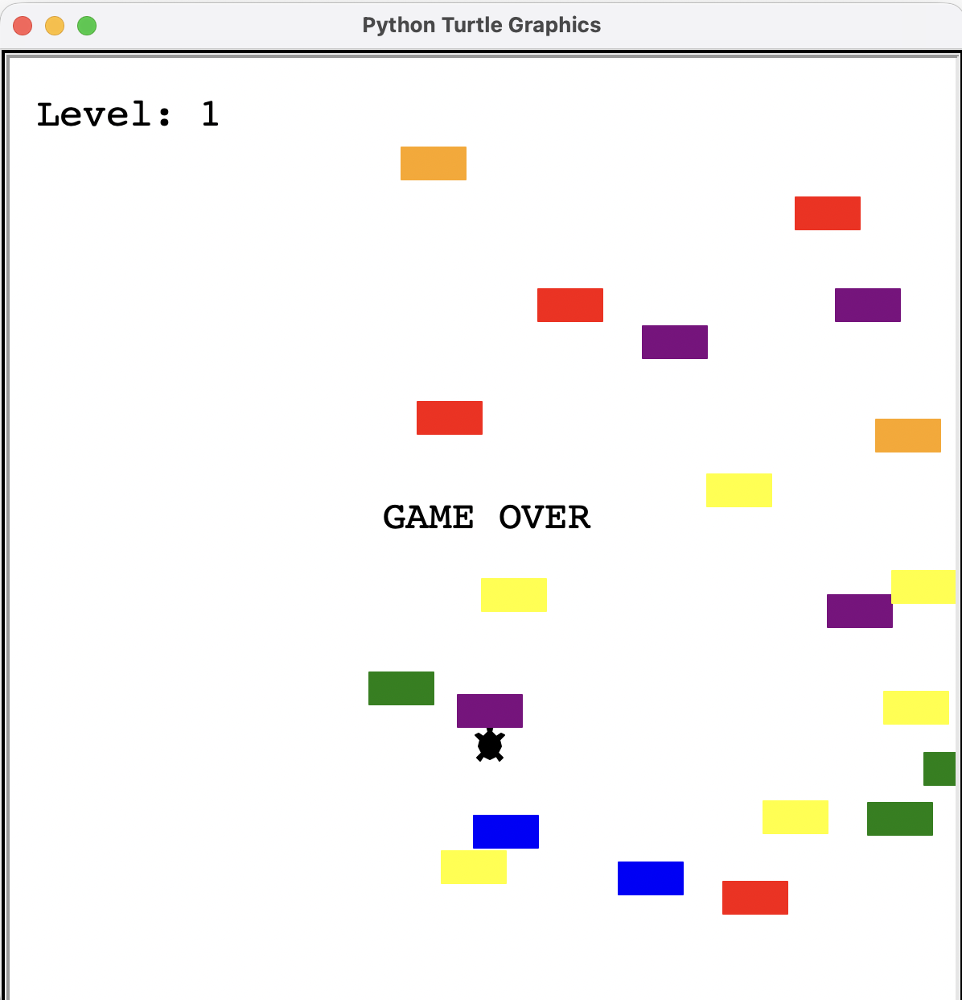

# Turtle Crossing Game

A simple, beginner-friendly arcade game built with Python's turtle module. Guide the turtle across the road while avoiding cars — a small project to practice game loops, collision detection, and object-oriented design.



> If you add an animated demo (demo.gif) to the repository root, the README will show it here instead of the static screenshot. Example: ``

## Features
- Move a player turtle from bottom to top of the screen to score points.
- Randomly spawning cars that travel across the screen at increasing speed.
- Scoreboard that tracks player progress.

## Requirements
- Python 3.8+ (the turtle module is included in the standard library)

## Files
- `main.py` — game entry point (run this to start the game)
- `player.py` — player (turtle) class and movement controls
- `car_manager.py` — spawns and moves cars across the screen
- `scoreboard.py` — displays and updates the score
- `Screenshot.png` — gameplay screenshot used in this README

## Controls
- Up arrow — move the turtle forward

Notes on controls and how to add more
- The game currently binds only the Up arrow (see `main.py`). To add more movement (left, right, back), add methods to `Player` and bind them in `main.py`.

Example: add these methods to `player.py`:

```python
# inside Player class in player.py
def go_left(self):
    self.setx(self.xcor() - MOVE_DISTANCE)

def go_right(self):
    self.setx(self.xcor() + MOVE_DISTANCE)

def go_back(self):
    self.backward(MOVE_DISTANCE)
```

Then bind in `main.py`:

```python
screen.onkey(player.go_left, "Left")
screen.onkey(player.go_right, "Right")
screen.onkey(player.go_back, "Down")
```

Careful: because turtle graphics uses absolute coordinates, you may want to clamp x-position to the visible window bounds.

## How to run
1. Make sure you have Python 3 installed: `python --version`
2. (Optional) Create and activate a virtual environment:

```bash
python -m venv venv
# macOS / Linux
source venv/bin/activate
# Windows (PowerShell)
venv\Scripts\Activate.ps1
```

3. From the repository root, run:

```bash
python main.py
```

The game opens in a new window using the turtle graphics library.

## Notes
- This is a small learning project; feel free to fork and experiment with features such as multiple lanes, lives, or power-ups.
